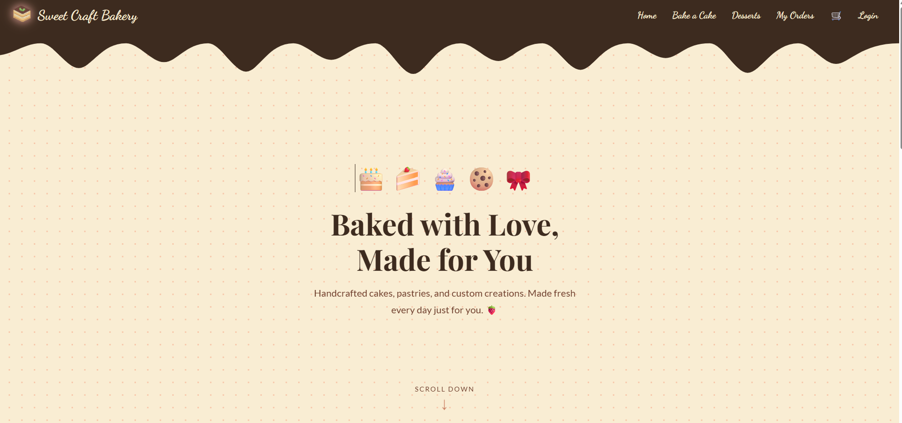

# Sweet Craft Bakery

An interactive bakery website where users can browse desserts, build a custom cake, manage a cart, and place orders. Built as a full-stack MERN-style app with a React frontend and an Express/MySQL backend.

## Demo

- [Welcome page walkthrough](./docs/welcomedemo.mp4)
- [Browsing desserts](./docs/desserts.mp4)
- [Building a custom cake](./docs/bakeacakedemo.mp4)

## Screenshot



## Features

- **Browse desserts** — view available desserts fetched from the database
- **Build a cake** — customize a cake through the Bake-a-Cake page
- **Cart** — add items and manage a shopping cart via React Context
- **User accounts** — register and log in with JWT-based authentication
- **Orders** — place an order and view past orders per user

## Tech Stack

**Client**
- React 19 with React Router
- Bootstrap 5
- Axios for API calls

**Server**
- Node.js with Express 5
- MySQL (`mysql` package, connection pool)
- bcrypt for password hashing
- jsonwebtoken for auth tokens
- dotenv for environment config

## Project Structure

```
Sweet-Craft-Bakery/
├── client/               # React app
│   └── src/
│       ├── components/   # Layout, Navbar
│       ├── context/      # CartContext, UserContext
│       ├── pages/        # Welcome, Login, Register, Desserts, BakeACake, Cart
│       └── styles/
└── server/               # Express API
    ├── config/           # MySQL connection (db.js)
    ├── routes/           # auth.js, orders.js
    └── server.js         # app entry point
```

## Getting Started

### Prerequisites
- Node.js and npm
- A running MySQL server

### 1. Clone the repo
```bash
git clone https://github.com/elifnalan/Sweet-Craft-Bakery.git
cd Sweet-Craft-Bakery
```

### 2. Set up the server
```bash
cd server
npm install
```

Create a `.env` file in `server/` with:
```
DB_HOST=localhost
DB_USER=your_mysql_user
DB_PASSWORD=your_mysql_password
DB_NAME=your_database_name
JWT_SECRET=your_jwt_secret
PORT=5000
```

Set up the required tables (`users`, `desserts`, `orders`, `order_items`) in your MySQL database, then start the server:
```bash
npm run dev
```

### 3. Set up the client
In a new terminal:
```bash
cd client
npm install
npm start
```

The client runs on `http://localhost:3000` and proxies API requests to the server on `http://localhost:5000`.

## API Endpoints

| Method | Endpoint              | Description                  |
|--------|-----------------------|-------------------------------|
| POST   | `/api/auth/register`  | Register a new user           |
| POST   | `/api/auth/login`     | Log in and receive a JWT      |
| GET    | `/api/desserts`       | Get all desserts              |
| POST   | `/api/orders`         | Create a new order            |
| GET    | `/api/orders/:user_id`| Get all orders for a user     |

## License

No license specified yet.